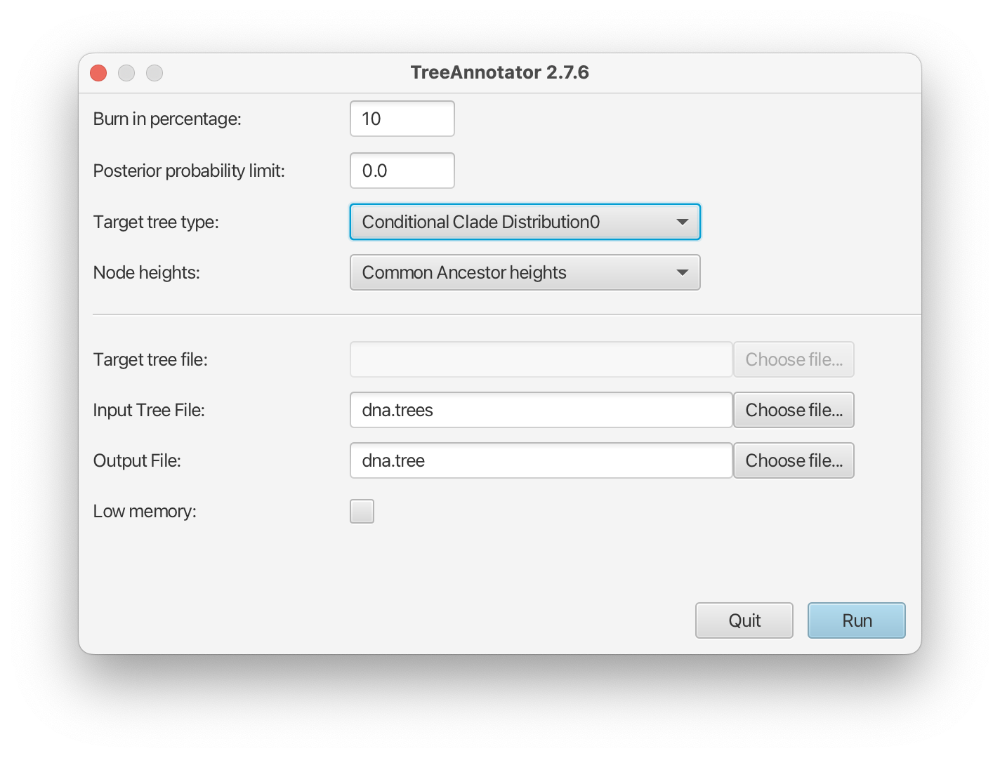

## CCD Package for [BEAST 2](https://www.beast2.org/)

Implementation of the conditional clade distribution (CCD), which offers an estimates of the posterior tree (topology) distribution learned from the sample, as well as associated tools and algorithms.
Three parametrisations of a CCD are implemented, namely, based on clade frequencies (CCD0), clade split frequencies (CCD1), and pairs of clade split frequencies (CCD2).
Furthermore, point estimators based on the CCDs are implemented,
which allows TreeAnnotator to produce better summary trees than via MCC trees (which is restricted to the sample).
The package further incldues tools for entropy-based rogue analysis and rogue removal.

See the [CCD-Research repository](https://github.com/CompEvol/CCD-Research) for information, scripts, and data of the associated research papers,
and see the instructions below on how to use the tools.

## Install the package

### Installing through BEAUti

CCD is a [BEAST2](http://beast2.org) package that requires BEAST 2 v2.7.6.
If you have not already done so, you can get BEAST 2 from [here](http://beast2.org).

To install CCD, it is easiest to start BEAUti (a program that is part of BEAST), and select the menu `File/Manage packages`. A package manager dialog pops up, that looks something like this:


If the CCD package is listed, just click on it to select it, and hit the `Install/Upgrade` button.

If the CCD package is not listed, you may need to add a package repository by clicking the `Package repositories` button. A window pops up where you can click `Add URL` and add `https://raw.githubusercontent.com/CompEvol/CBAN/master/packages-extra-2.7.xml` in the entry. After clicking OK, the dialog should look something like this:


Click OK and now CCD should be listed in the package manager (as in the first dialog above). Select and click Install/Upgrade to install.

### Install by hand

* Download the package from [here](https://github.com/CompEvol/CCD/releases/download/v0.0.1/CCD.package.v0.0.4.zip)
* Create CCD directory inside BEAST package directory
  * for Windows in Users\<YourName>\BEAST\2.X\VSS
  * for Mac in /Users/<YourName>\/Library/Application Support/BEAST/2.X/VSS
  * for Linux /home/<YourName>/.beast/2.X/VSS
  Here <YourName> is the username you use, and in “2.X” the X refers to the major version of BEAST, so 2.X=2.7 for version 2.7.6.
* Unzip the file `CCD.package.v0.0.1.zip` inside the CCD directory

## Build from code

* Get code for beast2, BeastFX and CCD repositories:
  * git clone https://github.com/CompEvol/beast2.git
  * git clone https://github.com/CompEvol/BeastFX.git
  * git clone https://github.com/CompEvol/CCD.git
* Run `ant install` from the CCD directory
  
## Usage

### Point Estimates

The tree topolgy point estimate provided by CCD's is called the CCD MAP tree and is best accessed through TreeAnnotator.
See also the general [tutorial](https://beast2.blogs.auckland.ac.nz/treeannotator/);
the steps are to start TreeAnnotator, and select `MAP (CCD0)` from the drop down box next to `Target tree type`:



TreeAnnotator and thus the CCD point estimates can also be accessed from the terminal.
Simply but `CCD0` as option for the topology (`-topology`).
In full, the call from a terminal for Linux and OS X would be

```
/path/to/beast/bin/treeannotator -topology CCD0 input.trees output.tree
```

where `/path/to` the path to where BEAST is installed. For Windows, use

```
\path\to\BEAST\bat\treeannotator.bat -topology CCD0 input.trees output.tree
```

For CCD1 based point estimates select `MAP (CCD1)` from the drop down box in the GUI, or use `CCD1` instead of `CCD0` for the command line version.

### Phylogenetic Entropy, Rogue & Skeleton Analysis

The CCD package has three tools (small apps) to compute the phylogenetic entropy of a tree set, compute rogues scores for each clade, and conduct a skeleton anaylsis
that can each be executed with [BEAST2's AppLauncher](http://www.beast2.org/2019/07/23/better-apps-for-the-beast-appstore.html). 
Note that the given trees *need to be binary* and are assumed to be rooted; they are typically given by a NEXUS `.tree` file, but a list of Newick strings also works.
For more information on the concepts see the [paper](https://www.biorxiv.org/content/10.1101/2024.09.25.615070v1) 
and for further information and example data see the [research paper repository](https://github.com/CompEvol/CCD-Research/tree/main/skeletonsAndRogues).


#### Phylogenetic Entropy
You can compute the **phylogenetic entropy** of your posterior tree distribution with [BEAST2's AppLauncher](http://www.beast2.org/2019/07/23/better-apps-for-the-beast-appstore.html).
The tool `EntropyCalculator` computes the phylogenetic entrpoy of our posterior tree distribution (computed via CCD). You can call from the terminal with the following command:
```
/path/to/applauncher EntropyCalculator -trees /path/to/treeInputFile.trees -burnin 10 -ccdType CCD0
```
It has three parameters:
- `trees`: trees file for which to compute entropy (required)
- `burnin`: percentage of trees to be used as burn-in (default: `10%`)
- `ccdType`: either `CCD0`, `CCD1`, or `CCD2` (default: `CCD0`)


### Rogue Analysis

A rogue analysis computes a **rogue score** for each clade, including each taxon, based on a given posterior sample of *binary* trees and some parameters and prints it to a csv file.
Furthermore, it annotates each clade in a CCD MAP tree with the respective rogue score.
The start a rogue analysis, you can use this command:
```
/path/to/applauncher RogueAnalysis -trees /path/to/treeInputFile.trees -burnin 10 -minProbability 0.1 -out outputFileWithoutEnding
```
The app has the following parameters:
- `trees`: trees file to construct CCD with and analyse (required)
- `burnin`: percentage of trees that is burnin (default: `10%`)
- `ccdType`: either `CCD0` or `CCD1` (default: `CCD0`)
- `maxCladeSize`: maximum size for clade to be analysed (default: `10`)
- `minProbability`: minimum probability for clade to be analysed (default: `0.1`)
- `heightSettingStrategy`: heights used in MAP tree output, can be `CA` (Mean of Least Common Ancestor heights), `MH` (mean sampled height), or `ONE` (default: `CA`)
- `out`: file name for output (without file ending), will be used with '.csv' for rogue score and '.trees' for annotated MAP trees
- `separator`: separator used in csv file (default: `tab`)

### Skeleton Analysis

A skeleton analysis iteratively removes the clade with the highest rogue score until a threshold is reached.
```
/path/to/applauncher SkeletonAnalysis -trees /path/to/treeInputFile.trees -burnin 10 -out path/to/outputTreeFile.trees
```
The app has the following parameters:
- `trees`: trees file to construct CCD with and analyse (required)
- `burnin`: percentage of trees to be used as burn-in (default: `10%`)
- `ccdType`: either `CCD0` or `CCD1` (default: `CCD0`)

Two important parameters are the termination strategy and its threshold.
- `terminationStrategy`: termination strategy (default: `Entropy`, default treshold: `10`); other options are `Exhaustive`, `NumRogues` (fixed number of removed taxa),
`MaxProbability` (until CCD MAP tree has at least this probability, default threshold: `0.1`),
`Support` (until all clades have at least this support, default threshold: `0.5`)
- `terminationThreshold`: threshold for termination strategy, if not default or exhaustive strategy (default depends on strategy)
  
You can pick different strategies to detect rogues, though the default strategy based on the phylogenetic entropy (`Entropy`) is recommended,
and further speed up the computation by only consider clades for removal of small size and with significant probability.
- `detectionStrategy`: rogue detection strategy (default: `Entropy`); other options are `MaxProbability` (clade whose removal improves the probability of CCD MAP tree the most)
and `NumTopologies` (clade whose removal reduces the number of trees in the CCD the most)
- `maxCladeSize`: maximum clade size to consider removing (default: `10`)
- `minProbability`: minimum probability for clade to analyse (used to speed up computation, default: `0.5`)
  
If you further specify an output file, then the given tree set will be reduced/filtered to the remaining taxa
- `out`: reduced tree output file; th given tree set will not be filtered if not specified
- `exclude`: file name of text file containing taxa to exclude from filtering - can be comma, tab or newline delimited


