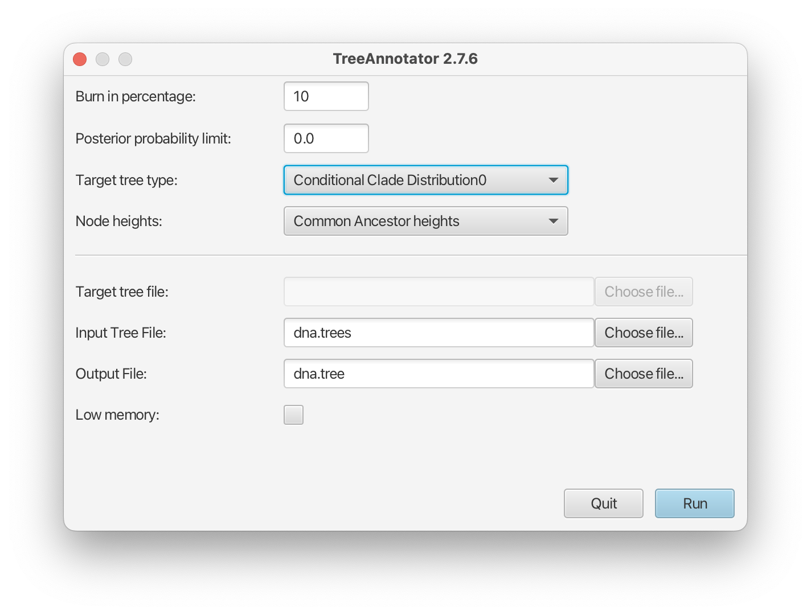

# CCD Package for [BEAST 3](https://github.com/CompEvol)

Implementation of the conditional clade distribution (CCD), which offers estimators of the posterior tree (topology) distribution learned from the sample, as well as associated tools and algorithms.
Three parametrisations of a CCD are implemented, namely, based on clade frequencies (CCD0), clade split frequencies (CCD1), and pairs of clade split frequencies (CCD2).
Furthermore, point estimators based on the CCDs are implemented,
which allows TreeAnnotator to produce better summary trees than the MCC tree method (which is restricted to the sample).
The package further includes tools for entropy-based rogue analysis and rogue removal.

See the [CCD-Research repository](https://github.com/CompEvol/CCD-Research) for information, scripts, and data of the associated research papers,
and see the instructions below on how to use the tools.

## Maven coordinates

```xml
<dependency>
    <groupId>io.github.compevol</groupId>
    <artifactId>ccd</artifactId>
    <version>1.2.0</version>
</dependency>
```

JPMS module name: `ccd`

## Build from source

Requires JDK 25+.

```bash
git clone https://github.com/CompEvol/CCD.git
cd CCD
mvn clean verify
```

This produces `target/CCD.v1.2.0.zip` (the BEAST package) and `target/ccd-1.2.0-SNAPSHOT.jar`.

### Running from Maven

After building, you can run BEAST tools with CCD on the module path using `mvn exec:exec`.

Run TreeAnnotator with CCD0 topology:

```bash
mvn exec:exec \
  -Dbeast.module=beast.fx \
  -Dbeast.main=beastfx.app.treeannotator.TreeAnnotator \
  -Dbeast.args="-topology CCD0 -height mean -burnin 10 input.trees output.tree"
```

Available topologies: `CCD0`, `CCD1`, `CCD2`, `CCD0Approx`, `HIPSTR`.

Run BEAST with CCD on the module path:

```bash
mvn exec:exec -Dbeast.args="examples/myanalysis.xml"
```

## Usage

### Point Estimates

The tree topology point estimate provided by CCD's is called the CCD MAP tree and is best accessed through TreeAnnotator.
See also the general [tutorial](https://beast2.blogs.auckland.ac.nz/treeannotator/);
the steps are to start TreeAnnotator, and select `MAP (CCD0)` from the drop down box next to `Target tree type`:



TreeAnnotator and thus the CCD point estimates can also be accessed from the terminal.
Simply put `CCD0` as option for the topology (`-topology`).
In full, the call from a terminal for Linux and OS X would be

```
/path/to/beast/bin/treeannotator -topology CCD0 input.trees output.tree
```

where `/path/to` the path to where BEAST is installed. For Windows, use

```
\path\to\BEAST\bat\treeannotator.bat -topology CCD0 input.trees output.tree
```

For CCD1 based point estimates select `MAP (CCD1)` from the drop down box in the GUI, or use `CCD1` instead of `CCD0` for the command line version.

### AppLauncher Tools

The CCD package comes with a set of tools (small apps) that can each be executed with BEAST's AppLauncher.
Note that the given trees *need to be binary* and are assumed to be rooted; they are typically given by a NEXUS `.tree` file, but a list of Newick strings also works.
When a tool finishes, it prints the reference(s) to cite for the method it implements; this is written to stderr, so it does not interfere with results written to stdout.
For more information on the concepts behind the entropy, rogue and skeleton tools see the [paper](https://www.biorxiv.org/content/10.1101/2024.09.25.615070v1)
and for further information and example data see the [research paper repository](https://github.com/CompEvol/CCD-Research/tree/main/skeletonsAndRogues).


#### Phylogenetic Entropy
You can compute the **phylogenetic entropy** of your posterior tree distribution with BEAST's AppLauncher.
The tool `EntropyCalculator` computes the phylogenetic entropy of your posterior tree distribution (computed via CCD). You can call from the terminal with the following command:
```
/path/to/applauncher EntropyCalculator -trees /path/to/treeInputFile.trees -burnin 10 -ccdType CCD0
```
It has three parameters:
- `trees`: trees file for which to compute entropy (required)
- `burnin`: percentage of trees to be used as burn-in (default: `10%`)
- `ccdType`: either `CCD0`, `CCD1`, or `CCD2` (default: `CCD0`)


#### Dissonance

The tool `DissonanceCalculator` computes the phylogenetic entropy (via CCD0) of one or more tree sets and, with the `dissonance` flag, also reports a dissonance value for each of them.
The dissonance is computed by splitting a tree set into its first and second half and subtracting the mean entropy of the two halves from the entropy of the whole set.
It is thus a diagnostic *within* a single tree set and not a comparison *between* the given tree files.
```
/path/to/applauncher DissonanceCalculator -trees /path/to/treeInputFile.trees -burnin 10 -dissonance true
```
The app has the following parameters:
- `trees`: trees file to analyse; can be given more than once to process several tree sets in one run
- `burnin`: percentage of trees to be used as burn-in (integer, default: `10%`)
- `dissonance`: `true` to also compute the dissonance of each tree set (default: `false`)
- `summarise`: `true` to print the mean and standard deviation of the entropies across all given tree sets (default: `false`)
- `quiet`: `true` to only output the entropy (and dissonance) values and nothing else (default: `false`)


#### Rogue Analysis

A rogue analysis computes a **rogue score** for each clade, including each taxon, based on a given posterior sample of *binary* trees and some parameters and prints it to a csv file.
Furthermore, it annotates each clade in a CCD MAP tree with the respective rogue score.
The start a rogue analysis, you can use this command:
```
/path/to/applauncher RogueAnalysis -trees /path/to/treeInputFile.trees -burnin 10 -minProbability 0.1 -out outputFileWithoutEnding
```
The app has the following parameters:
- `trees`: trees file to construct CCD with and analyse (required)
- `burnin`: percentage of trees that is burnin (default: `10%`)
- `ccdType`: either `CCD0` or `CCD1` (default: `CCD0`)
- `maxCladeSize`: maximum size for clade to be analysed (default: `10`)
- `minProbability`: minimum probability for clade to be analysed (default: `0.1`)
- `heightSettingStrategy`: heights used in MAP tree output, can be `CA` (Mean of Least Common Ancestor heights), `MH` (mean sampled height), or `ONE` (default: `CA`)
- `out`: file name for output (without file ending), will be used with '.csv' for rogue score and '.trees' for annotated MAP trees
- `separator`: separator used in csv file (default: `tab`)

#### Skeleton Analysis

A skeleton analysis iteratively removes the clade with the highest rogue score until a threshold is reached.
```
/path/to/applauncher SkeletonAnalysis -trees /path/to/treeInputFile.trees -burnin 10 -out path/to/outputTreeFile.trees
```
The app has the following parameters:
- `trees`: trees file to construct CCD with and analyse (required)
- `burnin`: percentage of trees to be used as burn-in (integer, default: `10%`)
- `ccdType`: either `CCD0` or `CCD1` (default: `CCD0`)

Two important parameters are the termination strategy and its threshold.
- `terminationStrategy`: termination strategy (default: `Entropy`, default treshold: `10`); other options are `Exhaustive`, `NumRogues` (fixed number of removed taxa),
`MaxProbability` (until CCD MAP tree has at least this probability, default threshold: `0.1`),
`Support` (until all clades have at least this support, default threshold: `0.5`)
- `terminationThreshold`: threshold for termination strategy, if not default or exhaustive strategy (default depends on strategy)
  
You can pick different strategies to detect rogues, though the default strategy based on the phylogenetic entropy (`Entropy`) is recommended,
and further speed up the computation by only consider clades for removal of small size and with significant probability.
- `detectionStrategy`: rogue detection strategy (default: `Entropy`); other options are `MaxProbability` (clade whose removal improves the probability of CCD MAP tree the most)
and `NumTopologies` (clade whose removal reduces the number of trees in the CCD the most)
- `maxCladeSize`: maximum clade size to consider removing (default: `10`)
- `minProbability`: minimum probability for clade to analyse (used to speed up computation, default: `0.5`)
  
If you further specify an output file, then the given tree set will be reduced/filtered to the remaining taxa
- `out`: reduced tree output file; the given tree set will not be filtered if not specified
- `exclude`: file name of text file containing taxa to exclude from filtering - can be comma, tab or newline delimited

#### Credible Level Evaluation

The **credible level** of a tree is the probability mass of the smallest credible set containing it,
that is, the smallest α for which the tree lies in an α credible set.
The tool `TreeCredibleLevel` computes it, together with the probability of the tree, from a CCD estimated from a posterior tree sample.
```
/path/to/applauncher TreeCredibleLevel -trees /path/to/treeInputFile.trees -tree /path/to/testTreeFile.tree -burnin 10 -out path/to/outputFile
```
The app has the following parameters:
- `trees`: trees file to construct the CCD with (required)
- `tree`: tree file containing the tree for which the probability and credible level are computed (required); only the first tree is used
- `out`: output file (required); the probability of the tree is written to the first line and its credible level to the second
- `burnin`: percentage of trees to be used as burn-in (integer, default: `10%`)
- `ccdType`: either `CCD0`, `CCD1`, or `CCD2` (default: `CCD0`)
- `method`: whether to use the probability-based method (`probability`, default) or a credible CCD (`credibleCCD`)
- `quiet`: `true` to only output the credible level and nothing else (default: `false`)

For the probability-based method one further parameter can be set:
- `numsamples`: the number of trees sampled from the CCD to compute the credible level thresholds (default: `100000`)

Both methods are described in the [credible sets paper](https://doi.org/10.1093/molbev/msag141):
Klawitter J, Drummond AJ (2026), *Bayesian credible sets for phylogenetic tree topologies with applications to coverage analysis and cross-model comparison*, Molecular Biology and Evolution 43(7), msag141.
